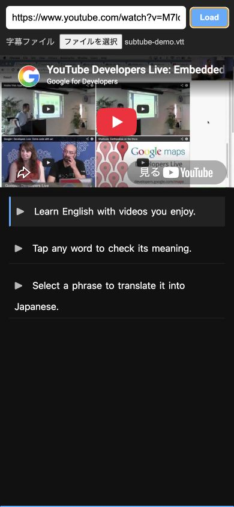
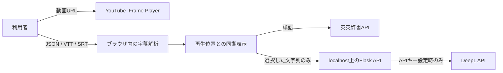

# Subtube

YouTube動画の再生位置と手元の字幕を同期し、その場で辞書検索・翻訳ができるローカル学習ツールです。

英語動画を視聴するときに、動画・字幕・辞書を何度も行き来する手間を減らすために開発しました。単語のタップで英英辞書を開き、文章を選択すると日本語へ翻訳できます。スマートフォンでの利用を想定したUIも備えています。



> **公開Webサービスではなく、ローカル実行を前提にしています。** その理由は[設計判断](#設計判断とトレードオフ)に記載しています。

## 主な機能

- YouTube動画と字幕のリアルタイム同期
- JSON・VTT・SRT字幕の読み込み
- 字幕行から指定位置へのシーク
- 単語タップによる英英辞書検索
- 選択範囲または単語の日本語翻訳（DeepL API設定時のみ）
- スマートフォン向けレイアウトと「寝ながらモード」
- 翻訳機能が未設定でも、動画・字幕・辞書機能を利用できる縮退動作

## 設計判断とトレードオフ

### 1. 字幕の自動取得を廃止し、利用者が用意したファイルを読み込む

当初は、非公式な手段でYouTube字幕を自動取得する構成を試作しました。しかし、次のリスクがあると判断しました。

- YouTubeの利用規約や提供者の意図との整合性を継続的に確認する必要がある
- YouTube側の仕様変更で、予告なく機能しなくなる可能性がある
- 公開サーバーのIPにアクセスが集中し、レート制限やブロックを受ける可能性がある

そこでポートフォリオ版では自動取得を廃止し、利用者が権利を持つ字幕ファイルをブラウザ内で解析する方式に変更しました。自動化の便利さは下がりますが、外部仕様への依存と運用リスクを小さくできます。

### 2. 公開サーバーではなく、localhostでのみ起動する

アプリは`127.0.0.1`にバインドし、不特定多数へのWeb公開を前提にしません。ライブデモの手軽さよりも、用途を個人学習に限定し、想定外の利用や集中アクセスを避けることを優先しました。

### 3. 翻訳は公式APIを任意機能として分離する

翻訳にはDeepLの公式APIを使用し、APIキーは環境変数で管理します。キーを設定しない場合は翻訳UIを無効化し、ほかの機能はそのまま利用できます。外部サービス障害や設定不足がアプリ全体の停止につながらない構成です。

### 4. 字幕解析をブラウザ側で完結させる

字幕ファイルはサーバーへアップロードせず、File APIでブラウザ内に読み込みます。サーバーの保存領域やアップロード処理を不要にする一方、端末側で扱えるサイズを考慮し、5 MBの上限を設けています。

## データフロー



- 字幕ファイルの内容はブラウザ内で処理し、Flaskサーバーには送信しません。
- 辞書検索時は選択した単語を外部の辞書APIへ送信します。
- 翻訳時は選択した文字列のみをローカルのFlask API経由でDeepLへ送信します。
- APIキーをフロントエンドへ公開せず、サーバー側の環境変数からのみ参照します。
- アプリ内で動画・字幕・検索結果を永続保存しません。

## 技術構成

| 分類 | 使用技術・方針 |
| --- | --- |
| バックエンド | Python 3.12 / Flask |
| フロントエンド | HTML / CSS / Vanilla JavaScript |
| 動画 | YouTube IFrame Player API |
| 字幕 | JSON / WebVTT / SRTをブラウザ側で解析 |
| 辞書 | Free Dictionary API |
| 翻訳 | DeepL API（任意） |
| テスト | `unittest` / Node.js Test Runner |
| CI | GitHub Actions |

フレームワークへの依存を必要最小限にし、字幕解析は副作用のない関数として分離しています。これにより、ブラウザUIを起動せずNode.jsから単体テストできます。

## セットアップ

### 必要なもの

- Python 3.12
- Node.js 20以降（JavaScriptテストを実行する場合のみ）
- インターネット接続（YouTube・辞書・翻訳機能に使用）

### 起動方法

```bash
git clone https://github.com/kento311/subtube-flask.git
cd subtube-flask
python3 -m venv .venv
source .venv/bin/activate
python -m pip install --requirement requirements.txt
python app.py
```

ブラウザで <http://127.0.0.1:8000> を開き、YouTube動画URLと字幕ファイルを指定します。翻訳を使わない場合、追加設定は不要です。

### 翻訳機能を有効にする

DeepL APIキーを取得し、起動前に環境変数を設定します。実際のキーを`.env`やソースコードへ記載してコミットしないでください。

```bash
export DEEPL_API_KEY="your-api-key"
export DEEPL_API_PLAN="auto"
python app.py
```

`DEEPL_API_PLAN`には`auto`、`free`、`pro`を指定できます。`auto`ではAPIキーの形式からエンドポイントを選択します。

## 字幕ファイル

VTTとSRTに加え、次の形式のJSONを読み込めます。

```json
[
  {
    "start": 0.0,
    "duration": 2.5,
    "text": "Welcome to the video."
  },
  {
    "start": 2.5,
    "duration": 3.0,
    "text": "Let's start learning English."
  }
]
```

- `start`: 動画開始からの秒数
- `duration`: 字幕を表示する秒数
- `text`: 字幕本文

`duration`の代わりに終了時刻を表す`end`も使用できます。

## テスト

Python:

```bash
python -m unittest discover -s tests -p "test_*.py" -v
```

JavaScript:

```bash
node --check static/app.js
node --check static/subtitles.js
node --test tests/js/subtitles.test.js
```

同じテストはGitHub Actionsでも、pushとPull Requestのたびに自動実行されます。

## ディレクトリ構成

```text
.
├── app.py                     # FlaskアプリとHTTP API
├── services/
│   └── translation.py        # DeepL連携とエラー境界
├── templates/
│   └── index.html            # 画面構造
├── static/
│   ├── app.js                # UI・動画同期・辞書・翻訳
│   ├── subtitles.js          # 字幕解析とURL検証
│   └── styles.css            # モバイル向け表示
├── tests/
│   ├── js/subtitles.test.js  # 字幕解析の単体テスト
│   ├── test_app.py           # Flask APIテスト
│   └── test_translation.py   # 翻訳サービスの単体テスト
└── .github/workflows/ci.yml  # CI設定
```

## セキュリティと制約

- Flaskへのリクエスト本文は16 KB、字幕ファイルは5 MBを上限としています。
- 外部サービスの詳細なエラーは利用者へ返さず、サーバーログに記録します。
- DOMへ外部由来の文字列を表示するときは`textContent`を使用しています。
- YouTube動画の視聴、字幕、辞書、翻訳には、それぞれのサービスやコンテンツの利用条件が適用されます。
- 本リポジトリは学習・ポートフォリオ用途であり、一般公開サービスとしての運用は想定していません。

## 開発で重視したこと

このプロジェクトでは、AIツールを未知の仕様の調査、実装案の比較、テスト観点の洗い出しに活用しました。一方で、解決する課題の定義、外部サービス利用に伴うリスクの特定、ローカル実行への設計変更、実行結果の検証は自分で行っています。

単に機能を増やすのではなく、用途とリスクに合わせて機能を削り、安全に維持できる範囲を決めることを重視しました。
